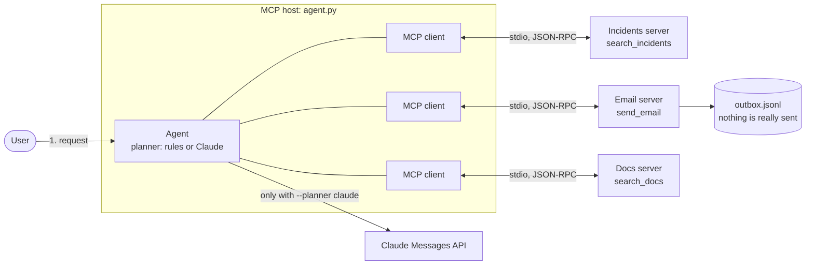

# How an AI agent uses MCP (Model Context Protocol)

A small, runnable Python sample that shows what happens between a user's request and an
AI agent's answer when the agent uses tools through the Model Context Protocol (MCP).
It accompanies the LinkedIn post "How an AI agent uses MCP (Model Context Protocol)".

LinkedIn post: (link added after publishing)

## What this sample shows

A user asks: *"Summarise this week's P1 incidents and email the team."*

The agent is an MCP **host**. It is connected to three MCP **servers** over stdio:
Incidents, Email and Docs. The run goes through eight steps:

1. The request arrives at the agent.
2. The agent asks every server what it offers (`tools/list`).
3. Each server returns its tool names and input schemas.
4. The agent calls `search_incidents` with priority `P1` and `days` 7 (`tools/call`).
5. 12 incidents come back as JSON.
6. The agent calls `send_email` to `ops-team` with a summary.
7. The email server confirms with status `sent`.
8. The agent answers the user.

The Docs server is discovered in steps 2 and 3 but never called, because nothing in the
request needs it.

By default everything is local and deterministic: no network, no API key, no real email,
and all data is fictional. An optional second mode lets Claude choose the tools instead.

## Architecture



The host starts each server as a subprocess and exchanges newline-delimited JSON-RPC
messages with it over stdin and stdout. The language model (when one is used) never talks
to an MCP server directly: the host makes every MCP call on the model's behalf.

## The eight steps and the MCP message behind each

| Step | What happens | MCP message | Where in `agent.py` |
|------|--------------|-------------|---------------------|
| - | The host starts each server and connects | `initialize` request, then `notifications/initialized` | `Host.connect()` |
| 1 | A user request arrives | none (not an MCP message) | `run_agent()` |
| 2 | The agent asks every server what it offers | `tools/list` request, one per server | `Host.discover()` |
| 3 | Each server returns tool names and input schemas | `tools/list` result | `build_catalog()` |
| 4 | The planner picks `search_incidents` and the host calls it | `tools/call` request | `Host.call_tool()` |
| 5 | 12 incidents come back as JSON | `tools/call` result (a text block holding JSON, `isError: false`) | `decode_result()` |
| 6 | The planner picks `send_email` and the host calls it | `tools/call` request | `Host.call_tool()` |
| 7 | The email server confirms `"status": "sent"` | `tools/call` result | `decode_result()` |
| 8 | The agent answers the user | none (not an MCP message) | `run_agent()` |

The trace that `agent.py` prints uses the same numbering and labels each line with its
message type (`tools/list`, `tools/call`, `result`).

## Prerequisites

- [uv](https://docs.astral.sh/uv/) (it creates the virtual environment and installs the
  pinned dependencies on first run)
- Python 3.10 or newer, which is the minimum of the MCP SDK. The sample was developed on
  Python 3.14 and its test suite also passes on 3.12 and 3.13.
- Only for `--planner claude`: an Anthropic API key in the environment variable
  `ANTHROPIC_API_KEY`

## Run it

```bash
uv run python agent.py
```

That runs the sample request with the offline rules planner. You can also pass your own
request and choose a planner:

```bash
uv run python agent.py "Find the runbook for checkout-api 5xx errors"
uv run python agent.py "Email ops-team the P2 incidents from the last 3 days"
uv run python agent.py --help
```

### Configuration

All configuration is through environment variables. There is nothing to edit in the code.

| Variable | Used by | Default | Purpose |
|----------|---------|---------|---------|
| `EMAIL_OUTBOX_PATH` | email server | `outbox.jsonl` in the project folder | File that the mock email server appends messages to |
| `ANTHROPIC_API_KEY` | `--planner claude` | none (required for that mode) | Anthropic API key, read from the environment only |
| `ANTHROPIC_MODEL` | `--planner claude` | `claude-opus-5-5` | Claude model id |

Exit codes: `0` success, `1` an expected failure (the reason is printed on stderr, for
example a request the rules planner cannot handle, a server that will not start, or an API
error), `2` `--planner claude` without `ANTHROPIC_API_KEY`.

### Sample output

Real output of `uv run python agent.py` (the message id differs on every run):

```text
Step 1   user -> agent          request     Summarise this week's P1 incidents and email the team.
         connect: incidents  initialize ok (protocol 2025-11-25, server incidents 0.1.0)
         connect: email  initialize ok (protocol 2025-11-25, server email 0.1.0)
         connect: docs  initialize ok (protocol 2025-11-25, server docs 0.1.0)
Step 2   agent -> every server  tools/list  incidents, email, docs
Step 3   every server -> agent  result      tool names + input schemas
           incidents  search_incidents(priority: string, days: integer)  [read-only]
                      Search incidents of one priority (P1-P4) opened within the last N days (1-90).
           email      send_email(to: string, subject: string, body: string)  [not read-only]
                      Send an email to a person or a distribution list such as 'ops-team'.
           docs       search_docs(query: string)  [read-only]
                      Search the runbook library by keywords (for example a service name or symptom).
Step 4   agent -> incidents     tools/call  search_incidents {"priority": "P1", "days": 7}
Step 5   incidents -> agent     result      12 items (JSON array)
           id=INC-4821 | title=Elevated 5xx rate on checkout-api after config rollout | priority=P1
           id=INC-4818 | title=Card authorisation timeouts for one acquirer | priority=P1
           ... and 10 more
Step 6   agent -> email         tools/call  send_email {"to": "ops-team", "subject": "P1 incident summary - last 7 days (12 incidents)", "body": "Hi team,\n\n12 P...
Step 7   email -> agent         result      {"status": "sent", "message_id": "msg-051184584e6f"}
Step 8   agent -> user          answer      Found 12 P1 incidents in the last 7 days.
         Emailed a summary to ops-team (message msg-051184584e6f, status: sent).
```

Nothing was delivered. The email server wrote the message to `outbox.jsonl` in the project
folder (listed in `.gitignore`). To read the stored message:

```bash
uv run python -c "import json,sys; r=json.loads(sys.stdin.read().splitlines()[-1]); print('To:     ', r['to']); print('Subject:', r['subject']); print(); print(r['body'])" < outbox.jsonl
```

```text
To:      ops-team
Subject: P1 incident summary - last 7 days (12 incidents)

Hi team,

12 P1 incidents opened in the last 7 days.

By service:
- checkout-api: 2
- payments-gateway: 2
- auth-service: 1
...
Incidents, newest first:
- INC-4821 [mitigated] checkout-api: Elevated 5xx rate on checkout-api after config rollout
- INC-4818 [resolved] payments-gateway: Card authorisation timeouts for one acquirer
...

Regards,
Incident assistant (demo)
```

(Lines marked `...` are shortened here; the file contains the full text.) Set
`EMAIL_OUTBOX_PATH` to write the outbox somewhere else.

### The request decides which servers are used

A request about a runbook uses only the Docs server. The Incidents and Email servers are
discovered but not called. (Steps 1 to 3 are the same as above and are left out here.)

```text
$ uv run python agent.py "Find the runbook for checkout-api 5xx errors"
Step 4   agent -> docs          tools/call  search_docs {"query": "Find the runbook for checkout-api 5xx errors"}
Step 5   docs -> agent          result      1 item (JSON array)
           title=Checkout API: elevated 5xx error rate | url=https://docs.example.com/runbooks/checkout-api-5xx
Step 6   agent -> user          answer      Found 1 runbook.
         - Checkout API: elevated 5xx error rate: https://docs.example.com/runbooks/checkout-api-5xx
```

### Bad input comes back as a readable error

The servers validate their input (priority must be `P1` to `P4`, `days` must be 1 to 90).
A rejected call does not crash anything; the server reports it inside the result with
`isError: true`, and the host shows it (steps 1 to 3 left out again):

```text
$ uv run python agent.py "Summarise P1 incidents from the last 120 days and email the team"
Step 4   agent -> incidents     tools/call  search_incidents {"priority": "P1", "days": 120}
Step 5   incidents -> agent     result      isError=true: Error executing tool search_incidents: Invalid days 120: must be a whole number between 1 and 90.
Step 6   agent -> user          answer      search_incidents failed: Error executing tool search_incidents: Invalid days 120: must be a whole number between 1 and 90.
```

No email is sent in that case.

## Let Claude choose the tools (`--planner claude`)

The default planner is a short list of keyword rules, so the sample runs offline and gives
the same result every time. With `--planner claude` the same host hands the discovered
tools to Claude and lets the model decide which to call:

```bash
export ANTHROPIC_API_KEY=<your key>      # read from the environment only, never from code
uv run python agent.py --planner claude
```

If you keep the key in a local `.env` file (it is listed in `.gitignore`), you can use
`uv run --env-file .env python agent.py --planner claude` instead.

If `ANTHROPIC_API_KEY` is not set, the command stops immediately with a clear message and
exit code 2. The model defaults to `claude-opus-5-5`; set `ANTHROPIC_MODEL` to use
another one, for example `claude-sonnet-5-5` for lower cost.

How it works (`claude_planner()` in `agent.py`):

1. Each MCP tool from `tools/list` is converted into a Claude tool definition by
   `mcp_tool_to_claude_tool()`. MCP and Claude both describe arguments with JSON Schema,
   so the mapping is almost one to one:

   | MCP tool | Claude tool |
   |----------|-------------|
   | `name` | `name` |
   | `description` | `description` |
   | `inputSchema` (`tool.input_schema` in Python) | `input_schema` |

2. The request and the tool definitions are sent to the Messages API.
3. When Claude replies with a `tool_use` block, the **host** performs the MCP `tools/call`
   and sends the output back as a `tool_result` block. A tool that reports `isError: true`
   is returned with `is_error: true`, so the model can read the message and correct itself.
4. The loop repeats until Claude replies with plain text, which becomes the answer
   (at most 8 round trips).

The trace keeps the numbered MCP steps and adds unnumbered lines that start with `LLM`
for each Messages API round trip, for example:

```text
LLM      agent -> Claude API    messages.create: model claude-opus-5-5, 3 tools, 1 message
LLM      Claude API -> agent    stop_reason=tool_use, tools chosen: search_incidents (tokens in/out ...)
```

The loop is written by hand on purpose, so that every MCP message is visible in the trace.
The Anthropic SDK also ships beta helpers for MCP (`anthropic.lib.tools.mcp`) that do the
conversion and the loop for you.

Request details worth knowing (see `build_claude_request()`): no `temperature` and no forced
`tool_choice` (the default model, `claude-opus-5-5`, rejects both, and so does `claude-sonnet-5-5`), `output_config.effort`
set to `medium`, and the opt-in server-side refusal fallback (beta
`server-side-fallback-2026-07-01`, Claude API only). These settings are meant for the default
model and the other current Claude Sonnet and Opus models. If you point `ANTHROPIC_MODEL` at
an older model (for example Claude Haiku 4.5, which does not support `effort`) or run through
another platform, adjust or remove them in `build_claude_request()`.

## The MCP code in a few lines

Client side (the host), from `Host.connect()`, `Host.discover()` and `Host.call_tool()`:

```python
import sys

from mcp import ClientSession, StdioServerParameters, stdio_client

params = StdioServerParameters(command=sys.executable, args=["servers/incidents_server.py"])
async with stdio_client(params) as (read, write):          # start the server, open stdio
    async with ClientSession(read, write) as session:
        await session.initialize()                          # initialize handshake
        tools = (await session.list_tools()).tools          # tools/list
        result = await session.call_tool(                   # tools/call
            "search_incidents", {"priority": "P1", "days": 7}
        )
```

Server side (see `servers/incidents_server.py`):

```python
from mcp.server.mcpserver import MCPServer

mcp = MCPServer("incidents")

@mcp.tool(structured_output=False)   # the result is one text block holding JSON
def search_incidents(priority: str, days: int) -> str:
    ...

mcp.run()   # stdio transport
```

What goes over the wire for the incidents server (captured from a real session, trimmed and
reordered for readability):

```jsonc
// host -> server
{"jsonrpc": "2.0", "id": 2, "method": "tools/list"}

// server -> host
{"jsonrpc": "2.0", "id": 2, "result": {"tools": [{
  "name": "search_incidents",
  "description": "Search incidents of one priority (P1-P4) opened within the last N days (1-90). ...",
  "inputSchema": {
    "type": "object",
    "properties": {
      "priority": {"type": "string", "description": "Incident priority: P1 (most severe) to P4 (least severe)."},
      "days":     {"type": "integer", "description": "Look-back window in days, from 1 to 90."}
    },
    "required": ["priority", "days"]
  },
  "annotations": {"readOnlyHint": true, "openWorldHint": false}
}]}}

// host -> server
{"jsonrpc": "2.0", "id": 3, "method": "tools/call",
 "params": {"name": "search_incidents", "arguments": {"priority": "P4", "days": 1}}}

// server -> host
{"jsonrpc": "2.0", "id": 3, "result": {"content": [{"type": "text", "text": "[]"}], "isError": false}}
```

The tools in this sample return a single JSON text block, which is the form every MCP client
understands. Each field of the tool result is a plain MCP concept: `content` is what the model
reads, `isError` tells the model that the call failed.

## Project layout

```text
agent.py                  the MCP host: connects, discovers, plans, calls tools, prints the trace
servers/
  incidents_server.py     MCP server with search_incidents (fixed mock data, 12 P1 incidents in 7 days)
  email_server.py         MCP server with send_email (appends to outbox.jsonl, sends nothing)
  docs_server.py          MCP server with search_docs (mock runbook links)
tests/                    pytest suite: real servers over real stdio, no network, no API key
  fixtures/               tiny servers used to test failure handling
pyproject.toml            dependencies, managed by uv
uv.lock                   exact resolved versions
.gitignore                excludes .venv, outbox.jsonl, .env and other local files
```

`agent.py` reads top to bottom: data types, trace output, the `Host`, the rules planner, the
Claude planner, and finally `run_agent()` and the command line.

## Run the tests

```bash
uv run pytest -q
```

Real output (takes about a minute, mostly starting server processes):

```text
........................................................................ [ 54%]
.............................................................            [100%]
133 passed in 59.44s
```

The suite starts the real server scripts and talks to them over real stdio. It covers:

- the full flow in rules mode: tools discovered on all three servers, exactly 12 incidents
  for P1 within 7 days, the email reported as `sent` and present in the outbox, and the Docs
  tool never called
- input validation: unknown priority (`P9`), `days` of 0 or 91, wrong argument types, and an
  empty result (P4 within 1 day), all returned as readable errors or an empty list
- the email outbox: `&amp; <b>` and emoji stored byte for byte, whitespace kept, a custom
  outbox path, and no way for the server to send real mail
- failure handling: a server that cannot start, a server that dies during a call, a tool
  name offered twice
- the Claude planner without calling Claude: the MCP-to-Claude tool conversion is unit
  tested, and the request loop runs against a fake Anthropic HTTP layer, including tool
  errors, refusals and the turn limit
- the command line: exit codes, the missing API key message, and the trace

The tests write to a temporary outbox and never touch `outbox.jsonl` in the project folder.

## Notes on security

- **No real email.** `send_email` only appends a line to a local file. The server has no
  network or SMTP code, and a test checks that.
- **API keys come from the environment only.** `ANTHROPIC_API_KEY` is read by the Anthropic
  SDK from the environment. The sample never prints, logs or stores it. `.env` is listed in
  `.gitignore`.
- **The servers do not inherit your environment.** The MCP stdio client starts each server
  with a small allow-list of variables (such as `PATH` and `HOME`). The host adds only
  `EMAIL_OUTBOX_PATH`, so your API key is not visible to the server processes. A test
  verifies this.
- **Treat servers and their output as untrusted.** An MCP server runs with your user's
  permissions, and its tool descriptions and results are text that a model will read, which
  makes prompt injection possible. Connect only servers you trust. Tool annotations such as
  `readOnlyHint` are hints, not guarantees. In a real deployment, ask a person to confirm
  calls with side effects such as sending email.
- **All data is fictional.** Incident ids, services, titles and URLs (`docs.example.com` is a
  reserved example domain) are invented.

## Notes on the MCP Python SDK 2.x

This sample uses `mcp` 2.2.0. If you know the 1.x SDK, these are the differences that
affected the code:

- `FastMCP` is now `MCPServer`: `from mcp.server.mcpserver import MCPServer`. Importing
  `mcp.server.fastmcp` raises `ModuleNotFoundError` with a pointer to the migration guide.
- Attributes of protocol types are snake_case in Python: `tool.input_schema`,
  `result.is_error`, `result.structured_content`. On the wire the names are still camelCase
  (`inputSchema`, `isError`).
- A tool must raise `ToolError` (`mcp.server.mcpserver.exceptions`) to send its message to
  the client. Any other exception reaches the client only as `Error executing tool <name>`,
  and the server logs a traceback.
- The SDK also has a higher-level `mcp.Client` and a stateless `server/discover` flow
  (protocol revision 2026-07-28). This sample keeps to `ClientSession` and the classic
  `initialize` handshake, which negotiated protocol 2025-11-25 here.

Also worth knowing:

- A tool that returns a list is sent as one text block per item plus `structured_content`
  of the form `{"result": [...]}`, and an empty list gives no content at all. The tools here
  return one JSON text block instead, and the host also understands `structured_content`.
- Exceptions raised inside `stdio_client()` or `ClientSession` blocks come out wrapped in
  nested `ExceptionGroup`s, so `run_agent()` catches expected errors inside the block and
  re-raises them after the connections have closed.

Resolved versions used for this sample (see `uv.lock`): mcp 2.2.0, mcp-types 2.2.0,
anthropic 1.11.0, pydantic 2.13.5, anyio 4.15.1, pytest 9.1.1, on Python 3.14.7.

## Limitations

This is a teaching sample, not a framework. It uses the stdio transport only (no HTTP,
no authentication), reads a single page of `tools/list`, requires tool names to be unique
across servers (a real host would namespace them), and does not use MCP resources, prompts
or sampling. The rules planner understands only a handful of phrasings; use
`--planner claude` for free-form requests.
