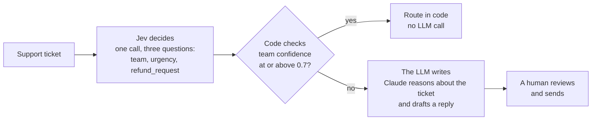

# Jev vs LLM: Jev decides, code checks, the LLM writes

A small, runnable Python sample for the LinkedIn post "Jev vs LLM". It triages fictional support
tickets in three steps and lets you compare the two kinds of interface behind them: a decision
model that returns typed answers with probabilities, and an LLM that returns JSON through
structured outputs.

LinkedIn post: https://www.linkedin.com/posts/soubh_agenticai-aiagents-llm-share-7512542410879500288-AHfd/

## What this sample shows

| Step | Who does it | In this sample |
|---|---|---|
| **Jev decides** | Jev, TypeSafe's "System One" decision model | One call with three named, typed questions: `team` (Choice: billing, technical, sales), `urgency` (Score: can wait, this week, today) and `refund_request` (Noul: the probability that the statement holds). |
| **Code checks** | Plain Python, no model | `route()` in `triage.py`. If the team confidence is at or above a threshold (default 0.7), the ticket is routed in code. Otherwise it is escalated. |
| **The LLM writes** | Claude | Only for escalated tickets: Claude reasons about the ticket and drafts a reply for a human to review. |

Jev does not write text, code, tool calls or plans. It answers the questions you define and
reports how confident it is. TypeSafe's own guidance is to combine those answers with
deterministic checks in code and to escalate low-confidence cases to a person or a reasoning
model. That is the shape of this sample.

A second path asks Claude for the same three fields through structured outputs (`--compare`), so
you can put the two interfaces side by side and, with real keys, measure latency, tokens and cost
per call on your own tickets.



## Prerequisites

- [uv](https://docs.astral.sh/uv/) and Python 3.10 or newer.
- Optional, for live runs only: `TYPESAFE_API_KEY` and `ANTHROPIC_API_KEY`.

Resolved versions used to build and test this sample (exact pins are in `uv.lock`):

| Package | Version |
|---|---|
| `typesafe-sdk` (published by TypeSafe AI) | 0.7.2 |
| `anthropic` (official Anthropic SDK) | 1.11.0 |
| `pytest` (tests only) | 9.1.1 |
| `httpx2` (the HTTP layer of both SDKs; the tests use its mock transport) | 2.13.1 |
| Python (CPython) | 3.14.4 |
| uv | 0.11.8 |

The tests also pass on Python 3.12.11. Both SDKs support Python 3.10 and newer, and the code uses
no newer syntax, but 3.10 and 3.11 were not run.

## Run it

### Offline (default)

```bash
uv run python triage.py
```

With no API keys set, both backends are small deterministic mocks that implement the same two
interfaces as the real ones. They are keyword rules, not models, so nothing is measured and no
timing, token count or cost is printed. If only one key is set, that one backend is live and the
other stays a mock. The first lines of the output say which is which.

Sample output from a real offline run:

<!-- offline-output:start -->
```text
Backends: Jev = mock (offline), Claude = mock (offline)
Mock backends are keyword rules, not models. They make no API calls, so timings, token counts and
costs are NOT measured and none are shown. Their confidence values are illustrative.
Rule: team confidence >= 0.70 is routed in code. Lower is escalated to Claude for a draft reply.

1. ROUTED    billing   urgency=today     refund=yes (0.90)  team confidence 0.82 >= 0.70
   "I was charged twice for my March invoice. Please refund the duplicate payment today."
2. ROUTED    technical urgency=today     refund=no (0.10)   team confidence 0.78 >= 0.70
   "Login fails with a 500 error since this morning and our whole team is blocked. Please help ASAP."
3. ROUTED    sales     urgency=can wait  refund=no (0.10)   team confidence 0.85 >= 0.70
   "We are 40 people and would like a demo of the enterprise plan, plus a quote for annual pricing."
4. ESCALATED team confidence 0.56 < 0.70 (technical 0.56, billing 0.33, sales 0.11)
   "My invoice shows an error and I cannot log in to download it. Not sure who handles this."
   Claude's draft, for a human to review:
     [mock draft: no model was called]
     Likely owner: technical (keyword guess).
     Draft reply: Thanks for getting in touch. A member of our team will read your
     message and reply soon. Could you tell us a little more about what you need?
5. ESCALATED team confidence 0.33 < 0.70 (billing 0.33, technical 0.33, sales 0.33)
   "Hello, can someone get back to me about my account when possible? Thanks."
   Claude's draft, for a human to review:
     [mock draft: no model was called]
     Likely owner: billing (keyword guess).
     Draft reply: Thanks for getting in touch. A member of our team will read your
     message and reply soon. Could you tell us a little more about what you need?
6. ROUTED    billing   urgency=can wait  refund=yes (0.90)  team confidence 0.78 >= 0.70
   "I was billed &pound;94 instead of &pound;49 &amp; I'd like a refund of the difference 💸. Invoice #1042 attached."

Tickets: 6 | routed in code: 4 | escalated to the LLM: 2
```
<!-- offline-output:end -->

Ticket 6 contains HTML entities and an emoji on purpose: the text is sent to both backends exactly
as written.

### Compare the two interfaces

```bash
uv run python triage.py --compare
```

This runs `decide()` on every ticket with both backends and prints one row per ticket and
backend. Offline, both columns come from the same keyword rules, so they match by construction
and the table only shows its shape:

<!-- offline-compare-output:start -->
```text
Backends: Jev = mock (offline), Claude = mock (offline)
Mock backends are keyword rules, not models. They make no API calls, so timings, token counts and
costs are NOT measured and none are shown. Their confidence values are illustrative.

#  backend  team       urgency   refund      latency  tokens in/out  cost (USD)
-  -------  ---------  --------  ----------  -------  -------------  ----------
1  Jev      billing    today     yes (0.90)  -        -              -
1  Claude   billing    today     yes         -        -              -
2  Jev      technical  today     no (0.10)   -        -              -
2  Claude   technical  today     no          -        -              -
3  Jev      sales      can wait  no (0.10)   -        -              -
3  Claude   sales      can wait  no          -        -              -
4  Jev      technical  can wait  no (0.10)   -        -              -
4  Claude   technical  can wait  no          -        -              -
5  Jev      billing    can wait  no (0.10)   -        -              -
5  Claude   billing    can wait  no          -        -              -
6  Jev      billing    can wait  yes (0.90)  -        -              -
6  Claude   billing    can wait  yes         -        -              -

"-" means not measured: a mock backend made no API call.
```
<!-- offline-compare-output:end -->

With real keys the latency, token and cost cells hold measured values for each call, and the
backend cell names the model the API says served it. Cost is shown as `n/a` when the API reports
no token counts, or when the model that served a call has no published price in the constants
block (for example a fallback model).

### Live

```bash
export TYPESAFE_API_KEY=<your TypeSafe key>
export ANTHROPIC_API_KEY=<your Anthropic key>
uv run python triage.py --live             # route, escalate and draft with real calls
uv run python triage.py --live --compare   # measure both interfaces on the sample tickets
```

`--live` requires both keys and never falls back to mocks. Without `--live`, a key that is set
selects the real backend automatically. Add `--offline` to force the mocks even when keys are set.
Live calls are billed to your accounts. To keep keys in a git-ignored `.env` file instead of your
shell, run `uv run --env-file .env python triage.py --live`.

| Option | Meaning |
|---|---|
| `--live` | Require both keys. Never use a mock. |
| `--offline` | Use the mocks even if keys are set. |
| `--compare` | Run Jev and Claude side by side on every ticket. |
| `--threshold 0-1` | Team confidence needed to route in code (default 0.7). |
| `--ticket "text"` | Triage this text instead of the sample tickets. |
| `ANTHROPIC_MODEL` | Environment variable. Overrides the default model `claude-opus-5-5`. |

## The two interfaces side by side

Jev, in `jev_backend.py`: one call, named typed questions, typed answers.

```python
response = client.system_one(state=ticket, questions={
    "team": Choice(instructions=..., criteria={"billing": ..., "technical": ..., "sales": ...}),
    "urgency": Score(instructions=..., criteria=["can wait", "this week", "today"]),
    "refund_request": Noul(instructions="The customer is asking for their money back..."),
})
response.choices["team"].choice               # "billing"
response.choices["team"].confidence           # 0 to 1
response.choices["team"].probabilities        # {"billing": ..., "technical": ..., "sales": ...}
response.scores["urgency"].probabilities      # {0: ..., 1: ..., 2: ...}
response.nouls["refund_request"].noul         # 0 to 1
```

Claude, in `claude_backend.py`: a prompt, a JSON Schema, and a check of `stop_reason` before the
content is read.

```python
response = client.beta.messages.create(
    model="claude-opus-5-5", max_tokens=16000, system=DECIDE_SYSTEM,
    messages=[{"role": "user", "content": ticket}],
    output_config={"effort": "low", "format": {"type": "json_schema", "schema": DECISION_SCHEMA}},
    betas=["server-side-fallback-2026-07-01"], fallbacks="default",
)
if response.stop_reason == "refusal": ...      # handled; never read response.content first
json.loads(text)                               # {"team": "billing", "urgency": "today", "refund_request": true}
```

| | Jev (System One) | Claude (structured outputs) |
|---|---|---|
| Team | Label, confidence and probabilities | Label |
| Urgency | Expected score, confidence and probabilities per level | Label |
| Refund | Probability from 0 to 1 | Boolean |
| Output you control | The question types and their criteria | A JSON Schema |
| Also available | Token counts in `response.usage` | Token counts in `response.usage`, plus `stop_reason` values such as `refusal` |

Both backends receive the same rubric, written once in `core.py`: Jev as question criteria,
Claude in its system prompt. An LLM can be asked to add a confidence field to its JSON, but that
number is generated text. This sample returns labels only, to keep the two interfaces as they are.

The sample does not measure accuracy. It has no labelled data, so it cannot say which backend is
right more often.

### Notes on the Claude calls

- The default model is `claude-opus-5-5`. Set `ANTHROPIC_MODEL` to use another current model.
- No `temperature`, no forced `tool_choice` and no `thinking` setting is sent. Claude Opus 5.5
  rejects the first two, and thinking is always on, so `effort` is the only dial: `low` for the
  decision, `medium` for the draft.
- `max_tokens` is 16000 because thinking tokens count toward it.
- Structured outputs use `output_config.format`, and the reply is parsed only after `stop_reason`
  is checked. A `refusal` raises `Declined`, which the pipeline and the compare table report
  without crashing, and a truncated reply (`max_tokens`) becomes a clear error instead of a JSON
  traceback.
- Both calls opt in to Anthropic's server-side fallback (`fallbacks: "default"` with the beta
  header `server-side-fallback-2026-07-01`). If a safety classifier declines a request, the API
  can re-run it on another model. Delete the `betas=` and `fallbacks=` lines in
  `claude_backend.py` to opt out.

### Notes on the TypeSafe SDK (0.7.2)

- `TypeSafeClient.system_one(state, questions, *, model, ...)` returns a `SystemOneResponse`.
  `AsyncTypeSafeClient` has the same surface; this sample uses the synchronous client.
- Both access paths exist: `response.answers[name]` (every answer type, so `.choice` fails on a
  Noul answer) and the typed views `response.choices`, `.scores` and `.nouls`, which the adapter
  uses.
- A Choice answer has `choice`, `confidence` and `probabilities`. A Score answer has `score` (an
  expected value that can fall between levels), `confidence`, `legend` and `probabilities`. A Noul
  answer has only `noul`. The adapter takes the urgency from the most likely level, not from the
  rounded expected score.
- Errors derive from `TypeSafeError`. API errors are `TypeSafeAPIError` subclasses by status
  (`TypeSafeAuthenticationError`, `TypeSafeRateLimitError`, and so on), and network failures are
  `TypeSafeAPIConnectionError` and `TypeSafeAPITimeoutError`.

## Run the tests

```bash
uv run pytest -q
```

The suite needs no network and no keys. `tests/conftest.py` removes the API keys from the
environment for every test and blocks socket connections, so a test cannot reach a real API even
by accident. The Jev and Claude paths are exercised against the real SDK classes with their HTTP
layer replaced by a mock transport. The tests cover routing (including the exact-threshold
boundary), the question definitions, the response adapter, the request sent to each API, refusal
and truncation handling, cost math, mock mode output, empty tickets, HTML entities, emoji and very
long input, and this README's sample output.

Live calls are not part of the test suite because they cost money and need keys. Run
`--live --compare` once with your own keys to see real numbers.

## Vendor figures

The speed and price figures for Jev are TypeSafe's own, not measured here:

- Speed: TypeSafe reports 70 to 500 ms end to end.
- Price: $0.042 per million input tokens, and output tokens are free. This matches TypeSafe's
  models page (docs.typesafe.ai/models), checked on 2026-10-02.

Claude Opus 5.5 is $4 per million input tokens and $20 per million output tokens, from Anthropic's
price table (platform.claude.com/docs/en/about-claude/pricing), checked on 2026-10-02.

All four prices live in one labelled block in `core.py`, and cost is computed only from that
block: input tokens times the input price plus output tokens times the output price. Caching,
batch discounts and data-residency multipliers are not applied. Prices change, so re-check them
before you quote them.

Treat the vendor figures as claims to test, and benchmark on your own tickets, region and load.
`--compare` takes one sample per ticket. The first call on a connection includes connection
setup, and the measured latency is wall-clock time around the SDK call, including any automatic
SDK retries.

## Security notes

- **Keys.** Keys are read only from the environment (`TYPESAFE_API_KEY`, `ANTHROPIC_API_KEY`).
  There are no keys in the code, `.env` files are git-ignored, and the tests use placeholder
  values that are not credentials. Error messages never print a key.
- **Data.** In live mode the ticket text is sent to TypeSafe and Anthropic. Use fictional or
  approved data, and check your data-handling terms before sending customer data.
- **Untrusted text.** A ticket is written by a customer. Jev only returns typed answers and
  cannot call tools. The Claude prompts tell the model to treat the ticket as data, and a draft is
  for a human to review and is never sent. The console output strips control characters, such as
  terminal escape sequences, from tickets and drafts.
- **No actions.** The sample has no tools. It cannot send email, change a record or call anything
  other than the two APIs.
- **Dependencies.** Official SDKs only, pinned in `uv.lock`.

## Project layout

| File | Purpose |
|---|---|
| `triage.py` | Command line, the `route()` check, the triage pipeline and the output. |
| `jev_backend.py` | The TypeSafe call, the three questions and the response adapter. |
| `claude_backend.py` | The Anthropic call (structured outputs) and the reply drafting. |
| `core.py` | Shared types, the rubric, the price block and the ticket check. |
| `mock_backends.py` | Offline keyword stand-ins for both backends. |
| `tickets.py` | The fictional sample tickets. |
| `tests/` | The pytest suite. |

## Limitations

- The mocks are keyword rules. Their confidence values are illustrative.
- Jev accepts 64k tokens per request (TypeSafe's models page). This sample does not chunk or
  truncate, so a ticket beyond a backend's limit fails with that API's error.
- Three teams, three urgency levels and one refund question keep the sample small. A real
  deployment needs its own rubric, labelled data and evaluation.
